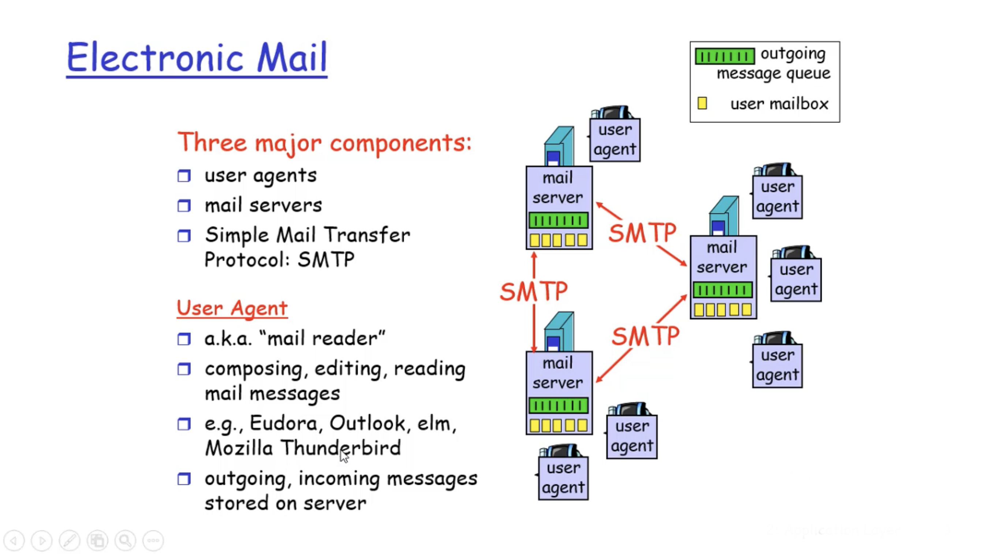
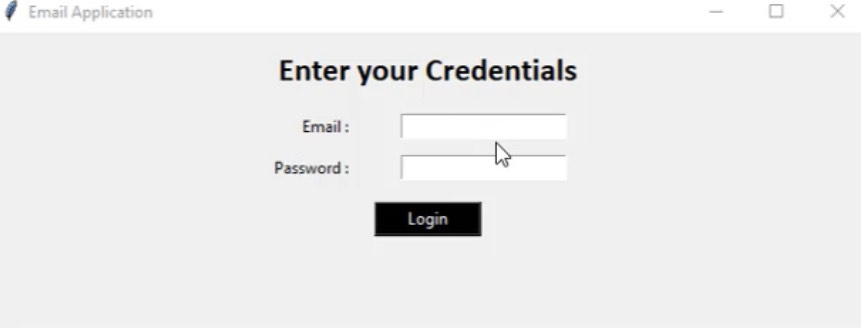
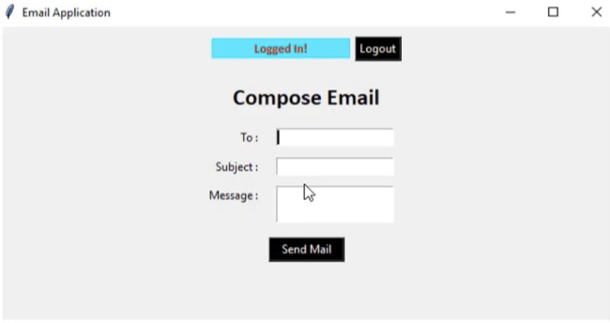

# Auto-Email-Sender-Application

#### What we need to know about before we start on with this application is what is ``SMTP``? 

`SMTP`, basically, is `Simple Mail Transfer Protocol` is a TCP or IP protocol that is used for sending and receiving emails. Users typically uses a program that uses SMTP for sending e-mail and either the top three or the IMAP (Internet Mesage Access Protocol) for receiving email.  SMTP remains the most common email protocol to send an email message. There are so-called fake e-mails that are messages sent using any address to any recipient. Another advantage of SMTP is the server limitation. You will be limited by the rules of your hosting are the boundaries of the connection with the Internet.

So now the question is that how we are going to send an email using the SMTP? Now, SMTP work basically as a three step process using a client server model. 

- The first step is that an email server uses SMS to send a message from an email client such as outbox or Gmail to an email server.

- The second step is that the email server uses the SMTP as a relay server to send the email to the receiving email server.

- Thirdly, the receiving server uses an email client to download incoming mail via the map and place it in the inbox of the recipient.

These are the three step process, which the SMTP uses to send an email.

     

For the output we will have two windows. The first window where we will be asked to enter the credential that include the email and password. After the login, the first page is going to pop up and will say logging successful. 

     

The second windows is going to display and ask you to compose your email. You are going to write the address to whom you want to send.

     

